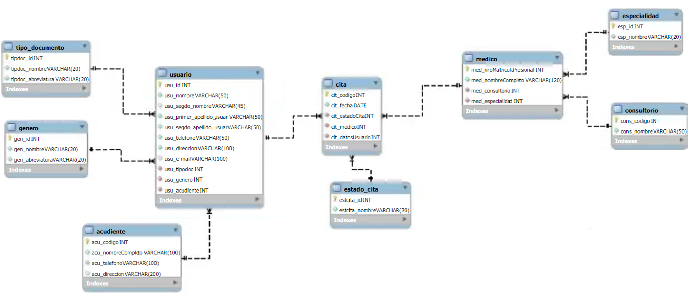

# Sistema de Gestión de Citas para CampusLands EPS

## Descripción del Proyecto

CampusLands EPS busca implementar un sistema de gestión de citas para su personal administrativo y pacientes. El sistema se desarrollará utilizando MongoDB, NodeJS y ExpressJS, sin el uso de librerías ODM como Mongoose. La conexión a la base de datos se realizará mediante el SRV proporcionado por MongoDB Atlas, y las credenciales se guardarán en variables de entorno utilizando dotenv.

## Requerimientos Técnicos

- **Base de Datos:** MongoDB Atlas.
- **Backend:** NodeJS y ExpressJS.

## Estructura de la Base de Datos

### Colecciones Principales (mínimo 10 documentos):

1. **Usuarios:** Información de los pacientes.
2. **Medicos:** Información de los médicos.
3. **Citas:** Detalles de las citas programadas.
4. **Consultorios:** Información de los consultorios.
5. **Genero:** Géneros de los pacientes.
6. **Estado_Cita:** Estados posibles de las citas.
7. **Tipo_Documento:** Tipos de documentos de identidad.

### Estados de Cita (para la colección Estado_Cita):

- Programada
- Confirmada
- En Curso
- Atendida
- Cancelada

## Endpoints

1. Obtener todos los pacientes de manera alfabética.
2. Obtener las citas de una fecha en específico, ordenando los pacientes alfabéticamente.
3. Obtener todos los médicos de una especialidad en específico.
4. Encontrar la próxima cita para un paciente en específico.
5. Encontrar todos los pacientes que tienen citas con un médico en específico.
6. Encontrar todas las citas de un día en específico.
7. Obtener todos los médicos con sus consultorios correspondientes.
8. Contar el número de citas que un médico tiene en un día específico.
9. Obtener el/los consultorio/s donde se aplicaron las citas de un paciente.
10. Obtener todas las citas realizadas por los pacientes de acuerdo al género registrado, siempre y cuando el estado de la cita se encuentre registrado como “Atendida”.
11. Insertar un paciente a la tabla usuario, permitiendo ingresar datos personalizados.
12. Mostrar todas las citas canceladas de un mes en específico.

## Consideraciones

- Para el registro de usuarios menores de edad, se deberá ingresar primero al acudiente y validar si ya estaba registrado.
- La conexión a la base de datos debe realizarse mediante el SRV de MongoDB Atlas y se deben guardar las credenciales en variables de entorno utilizando dotenv.

